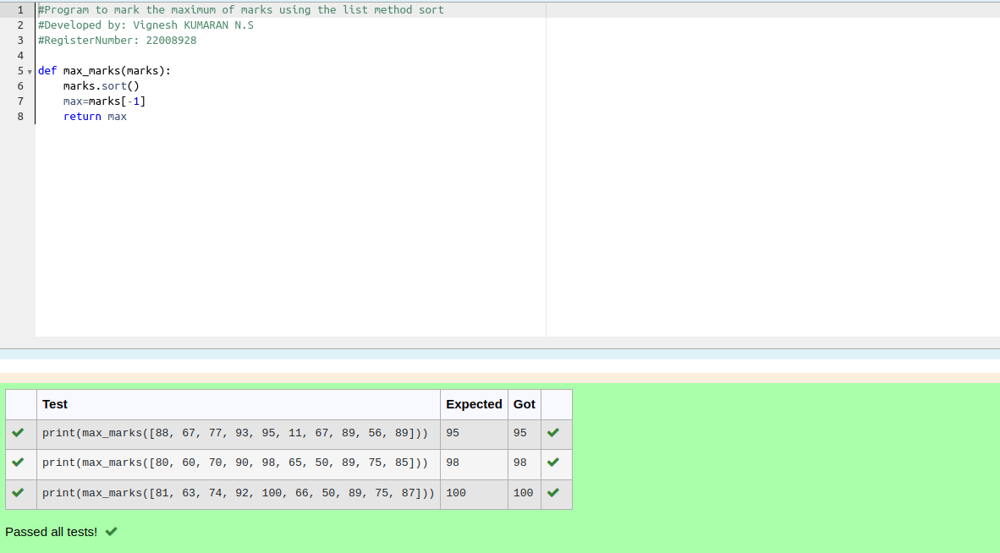

# Find the maximum of a list of numbers
## Aim:
To write a program to find the maximum of a list of numbers.
## Equipment’s required:
1.	Hardware – PCs
2.	Anaconda – Python 3.7 Installation / Moodle-Code Runner
## Algorithm:
1.	Get the list of marks as input
2.	Use the sort() function or max() function or use the for loop to find the maximum mark.
3.	Return the maximum value
## Program:

i)	# To find the maximum of marks using the list method sort.
```Python
#Program to mark the maximum of marks using the list method sort
#Developed by: Vignesh KUMARAN N.S
#RegisterNumber: 22008928

def max_marks(marks):
    marks.sort()
    max=marks[-1]
    return max


```

ii)	# To find the maximum marks using the list method max().
```Python
#Program to mark the maximum of marks using the list method sort
#Developed by: Vignesh KUMARAN N.S
#RegisterNumber: 22008928

def max_marks(marks):
    marks=max(marks)
    return marks


```

iii) # To find the maximum marks without using builtin functions.
```Python
#Program to mark the maximum of marks using the list method sort
#Developed by: Vignesh KUMARAN N.S
#RegisterNumber: 22008928

def max_marks(list):
    max = list[0]
    for i in list:
        if i >max:
            max = i
    return max


```
## Sample Input and Output
 

## Output:
Output 1:

Output 2:

Output 3:

## Result:
Thus the program to find the maximum of given numbers from the list is written and verified using python programming.